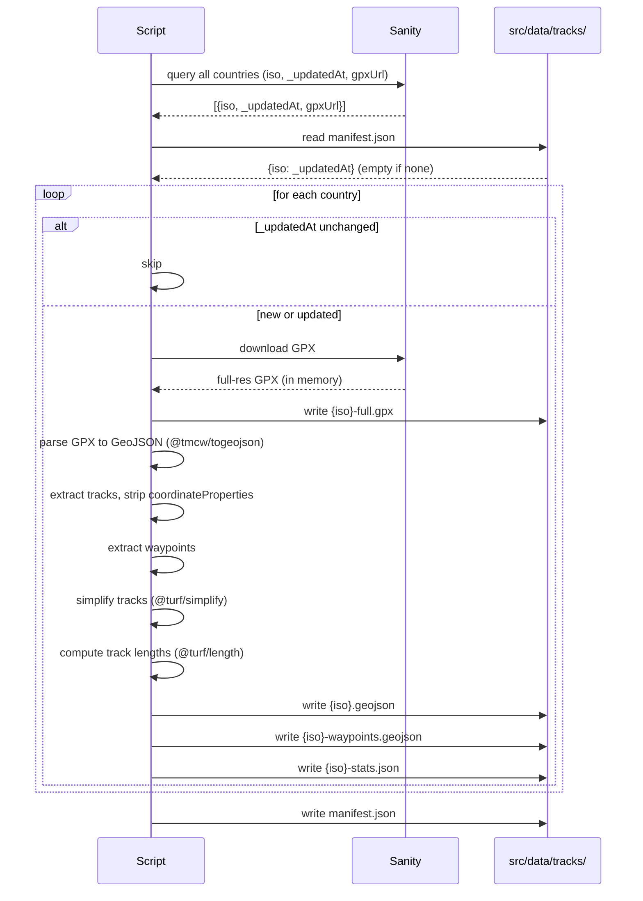

# Track Emission Pipeline

## Purpose

A pre-build script that fetches GPX files from Sanity, simplifies them, and writes three static assets per country to disk: a simplified GeoJSON for map rendering, a full-resolution GPX for download, and a stats JSON containing track lengths. It runs automatically before every production build and is invocable manually during local development.

Countries are identified throughout the pipeline by their ISO 3166-1 alpha-3 code (e.g. `fra`, `esp`). This code is a field on the Country document in Sanity and is the authoritative identifier for all file naming, manifest keys, and asset paths.

---

## Sequence



---

## Behaviour

### What the script does

1. Queries Sanity for all Country documents, retrieving `iso`, `_updatedAt`, and the GPX file asset URL for each
2. Loads the cache manifest (`src/data/tracks/manifest.json`) if one exists
3. For each country, compares the Sanity `_updatedAt` against the cached value
4. Skips countries whose `_updatedAt` is unchanged
5. For countries that are new or updated:
   - Downloads the full-resolution GPX from Sanity
   - Writes it to `src/data/tracks/{iso}-full.gpx`
   - Parses the GPX to GeoJSON using `@tmcw/togeojson`
   - Extracts track features (LineString); strips `coordinateProperties` from each (elevation/time data not needed for rendering)
   - Extracts waypoint features (Point)
   - Simplifies tracks using `@turf/simplify` (see [Simplification](#simplification))
   - Computes per-track lengths in kilometres using `@turf/length`
   - Writes simplified tracks to `src/data/tracks/{iso}.geojson`
   - Writes waypoints to `src/data/tracks/{iso}-waypoints.geojson`
   - Writes stats to `src/data/tracks/{iso}-stats.json`
6. Updates the manifest with the new `_updatedAt` values for all processed countries

The full-resolution GPX is fetched once and used for all outputs. Sanity is not contacted again during the Astro build.

### Example code

> Untested. Intended as a reference for structure and intent, not a drop-in implementation.

```ts
import { gpx } from '@tmcw/togeojson'
import { length, simplify } from '@turf/turf'
import { FeatureCollection, LineString, Point } from 'geojson'
import { DOMParser } from 'xmldom'
import fs from 'fs'

// --- GPX conversion ---

function convertGpxToGeoJson(gpxData: string): FeatureCollection {
  if (!gpxData.trim()) throw new Error('Invalid GPX data: must be a non-empty string')

  const xml = new DOMParser().parseFromString(gpxData, 'text/xml')

  // Abort if the XML parser encountered errors
  if (xml.getElementsByTagName('parsererror')[0]) {
    throw new Error('Invalid XML: GPX parsing failed')
  }

  const geoJson = gpx(xml)

  if (geoJson.features?.length === 0) throw new Error('Empty GeoJSON result')

  return geoJson
}

// --- Feature extraction ---

function extractWaypoints(data: FeatureCollection): FeatureCollection<Point> {
  return {
    type: 'FeatureCollection',
    features: data.features.filter(
      f => f.geometry.type === 'Point'
    ) as FeatureCollection<Point>['features'],
  }
}

function extractTracks(data: FeatureCollection): FeatureCollection<LineString> {
  return {
    type: 'FeatureCollection',
    features: data.features
      .filter(f => f.geometry.type === 'LineString')
      .map(track => {
        // Strip elevation/time data — not needed for map rendering
        if (track.properties?.coordinateProperties) {
          track.properties.coordinateProperties = {}
        }
        return track
      }) as FeatureCollection<LineString>['features'],
  }
}

// --- Simplification ---

function simplifyTracks(tracks: FeatureCollection<LineString>): FeatureCollection<LineString> {
  return {
    type: 'FeatureCollection',
    features: tracks.features.map(track =>
      simplify(track, { tolerance: 0.01, highQuality: true })
    ),
  }
}

// --- Length computation ---

// Keys by GPX track name (feature.properties.name) — reflects the actual segment names in the file
function computeTrackLengths(tracks: FeatureCollection<LineString>) {
  const trackLengths = tracks.features.reduce(
    (acc: Record<string, number>, feature) => {
      const name = feature.properties?.name
      if (name) {
        acc[name] = parseFloat(length(feature, { units: 'kilometers' }).toFixed(2))
      }
      return acc
    },
    {}
  )
  return { trackLengths }
}

// --- Emit script ---

const MANIFEST_PATH = 'src/data/tracks/manifest.json'

// Fetch all Country documents from Sanity — iso, _updatedAt, and GPX asset URL for each
const countries = await sanityClient.fetch(`*[_type == "country"]{ iso, _updatedAt, "gpxUrl": gpxFile.asset->url }`)

// Load manifest; if absent, all countries will be processed
const manifest: Record<string, string> = fs.existsSync(MANIFEST_PATH)
  ? JSON.parse(fs.readFileSync(MANIFEST_PATH, 'utf-8'))
  : {}

for (const country of countries) {
  const { iso, _updatedAt, gpxUrl } = country

  // Skip countries whose track data has not changed since last run
  if (manifest[iso] === _updatedAt) continue

  // Fetch full-resolution GPX from Sanity; write as-is for download
  const gpxData = await fetch(gpxUrl).then(r => r.text())
  fs.writeFileSync(`src/data/tracks/${iso}-full.gpx`, gpxData)

  // Convert, extract, simplify, and compute lengths
  const geoJson = convertGpxToGeoJson(gpxData)
  const tracks = extractTracks(geoJson)
  const waypoints = extractWaypoints(geoJson)
  const simplifiedTracks = simplifyTracks(tracks)
  const stats = computeTrackLengths(tracks)

  // Write rendering assets
  fs.writeFileSync(`src/data/tracks/${iso}.geojson`, JSON.stringify(simplifiedTracks))
  fs.writeFileSync(`src/data/tracks/${iso}-waypoints.geojson`, JSON.stringify(waypoints))
  fs.writeFileSync(`src/data/tracks/${iso}-stats.json`, JSON.stringify(stats))

  manifest[iso] = _updatedAt
}

// Persist updated manifest
fs.writeFileSync(MANIFEST_PATH, JSON.stringify(manifest, null, 2))
```

### Simplification

Simplification uses `@turf/simplify` with the following options:

```ts
simplify(track, { tolerance: 0.01, highQuality: true })
```

`tolerance` is in degrees. `0.01` is the same value used in the TET Atlas implementation and is the reference value for this project.

### Stats output

Track lengths are computed with `@turf/length` and written as a JSON object keyed by ISO alpha-3 code. The ISO code is passed into the length computation from the script's country loop — the GPX track name is not used as a key.

```json
{
  "trackLengths": {
    "TET_AL-01_20260416": 172.56,
    "TET_AL-02-Check Ferry times_20260416": 72.07,
    "TET_AL-03_20260416": 139.70
  }
}
```

Keys are the track names as stored in the GPX file (`feature.properties.name`). The file itself is named by ISO code (`alb-stats.json`).

Values are in kilometres, rounded to two decimal places.

---

## Libraries

| Library | Purpose |
|---------|---------|
| `@tmcw/togeojson` | GPX to GeoJSON conversion |
| `@turf/turf` | Track simplification (`simplify`) and length computation (`length`) |
| `xmldom` | DOM parser for GPX XML in a Node environment |

---

## Output

| File | Description |
|------|-------------|
| `src/data/tracks/{iso}.geojson` | Simplified tracks FeatureCollection for map rendering |
| `src/data/tracks/{iso}-waypoints.geojson` | Waypoints FeatureCollection for map rendering |
| `src/data/tracks/{iso}-full.gpx` | Full-resolution GPX for download |
| `src/data/tracks/{iso}-stats.json` | Per-track lengths in kilometres |
| `src/data/tracks/manifest.json` | Cache manifest mapping ISO code to `_updatedAt` |

---

## Cache manifest

The manifest is a flat JSON object keyed by ISO alpha-3 code:

```json
{
  "fra": "2026-03-01T12:00:00Z",
  "esp": "2026-01-15T08:30:00Z"
}
```

On each run the script reads this file, queries Sanity for current `_updatedAt` values across all countries, and processes only those whose value has advanced. After processing it writes the updated manifest back to disk. If no manifest exists, all countries are processed.

---

## npm scripts

```json
"scripts": {
  "emit-tracks": "tsx scripts/emit-tracks.ts",
  "prebuild": "npm run emit-tracks"
}
```

`prebuild` runs automatically before `npm run build`, ensuring CI always has current tracks. It does not run before `npm run dev` — developers invoke `emit-tracks` manually when they need updated data.

---

## Environment variables

| Variable | Description |
|----------|-------------|
| `SANITY_PROJECT_ID` | Sanity project ID |
| `SANITY_DATASET` | `production` or `development` |
| `SANITY_API_TOKEN` | Read-only API token |

---

## .gitignore

```
src/data/tracks/
```

The `src/data/tracks/` directory should exist in the repo with a `.gitkeep` so the path is present on a clean checkout without running the script.

---

## Local development

1. On first checkout, run `npm run emit-tracks` to populate `src/data/tracks/`
2. Re-run when working against current track data (e.g. map rendering work)
3. For component development that does not require real data, the fixture files are sufficient

### Fixture files

The following files are committed to the repository and used in Storybook stories and component tests. They are not referenced in production builds:

| File | Description |
|------|-------------|
| `src/data/tracks/_fixture.geojson` | Short representative simplified track |
| `src/data/tracks/_fixture-waypoints.geojson` | Matching waypoints |
| `src/data/tracks/_fixture-stats.json` | Matching stats |

---

## Map component integration

The Astro page for each country passes track paths as props to the MapLibre React island at build time:

```astro
<CountryMap
  trackPath={`/tracks/${country.iso}.geojson`}
  waypointsPath={`/tracks/${country.iso}-waypoints.geojson`}
  statsPath={`/tracks/${country.iso}-stats.json`}
/>
```

The component fetches these paths at runtime in the browser from the same Cloudflare Worker origin as the page. No Sanity URLs appear in the frontend. No `import.meta.env.DEV` branching is needed or expected.

---

## Download filename

The download link for the full-resolution GPX sets the `download` attribute on the anchor element. Astro has the country display name available at build time and renders it statically:

```astro
<a href={`/tracks/${country.iso}-full.gpx`} download={`TET-${country.name}.gpx`}>
  Download GPX
</a>
```

The browser uses the `download` attribute value as the filename when saving. No Worker logic or `Content-Disposition` header is required.

---

## Sanity schema dependency

The Country document must include an `iso` field containing the ISO 3166-1 alpha-3 code (e.g. `"fra"`, `"esp"`). This field is the authoritative identifier used throughout the pipeline. It must be present and populated for every country before the script is run.

---

## Out of scope

- GPX file validation (uploaded files are assumed pre-validated)
- Any write operations to Sanity